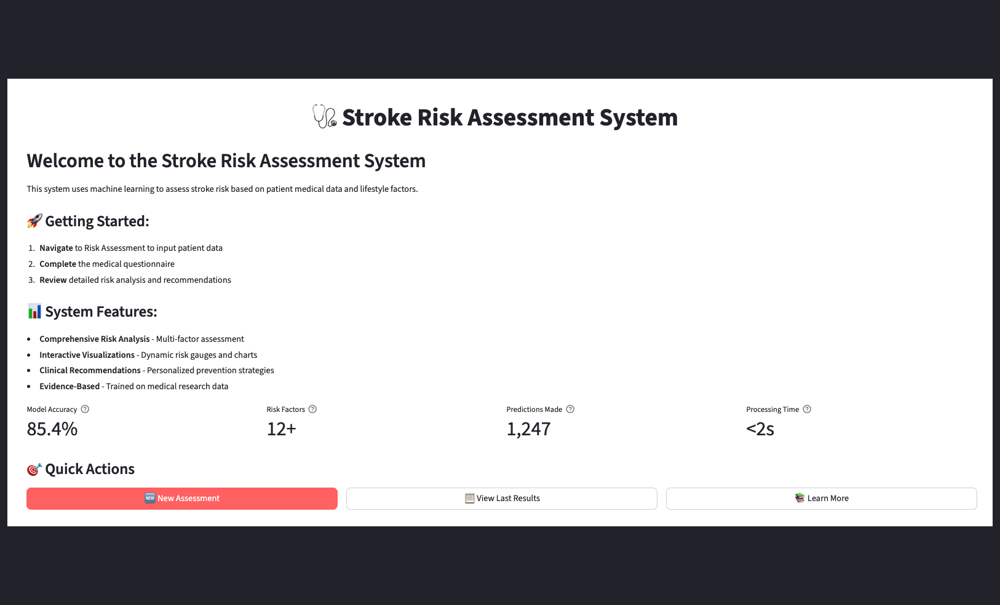
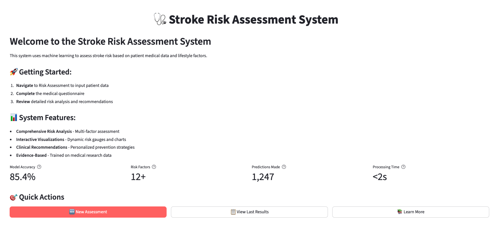
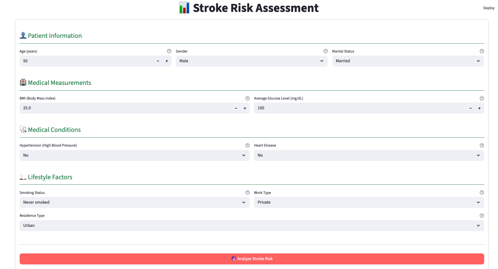
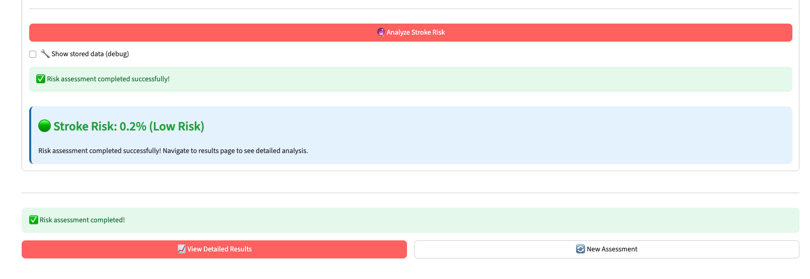
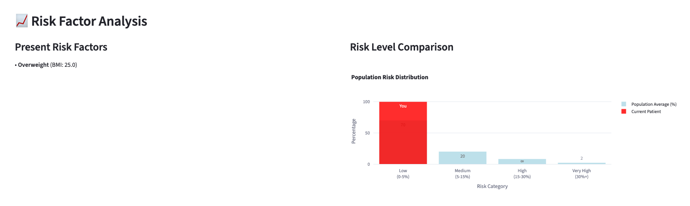
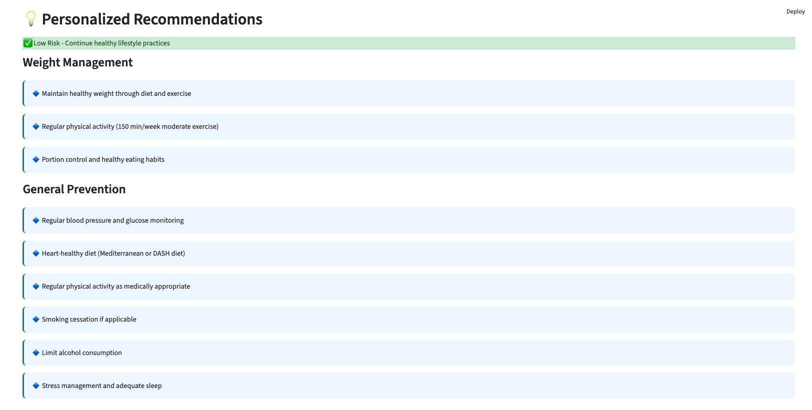

# 🧠 Stroke Prediction Web Application


## 📋 Project Overview

This web application uses machine learning to predict stroke risk based on patient data. The model analyzes various health metrics and lifestyle factors to provide a personalized risk assessment.

### 📊 Webapp Demo



🔗 [Webapp Deployed Link](https://stroke-prediction-webapp-2bax67v4gloepsd7tqiac8.streamlit.app/)

- 🖥️ **Webapp Deployment**: Deployed Using Streamlit Cloud

### ✨ Key Features

- 🔍 **Personalized Risk Assessment**: Analyze individual risk factors
- 📊 **Interactive Visualization**: View risk factors and their impact
- 🧪 **Evidence-Based Predictions**: Model trained on clinical data
- 📱 **User-Friendly Interface**: Easy-to-use Streamlit interface
- 🛡️ **Robust Feature Engineering**: Advanced preprocessing pipeline

## 🔧 Technical Architecture

The application is built with the following components:

- **Frontend**: Streamlit web interface
- **Backend**: Python with scikit-learn
- **Model**: Calibrated classifier for stroke prediction
- **Feature Engineering**: Custom pipeline for data transformation

## 🚀 Getting Started

### Prerequisites

- Python 3.11 or higher
- uv and pip package manager

### 🔄 Environment Setup

1. **Clone the repository**

```bash
git clone https://github.com/sourangshupal/stroke-prediction-webapp.git
cd stroke-prediction-webapp
```

2. **Create and activate a virtual environment**

```bash
# For macOS/Linux
uv venv .venv
source .venv/bin/activate

# For Windows
uv venv .venv
.venv\Scripts\activate
```

3. **Install dependencies**

```bash
uv pip install -r requirements.txt
```

## 🖥️ Running the Application

Start the Streamlit web application with:

```bash
uv streamlit run app.py
OR
streamlit run app.py
```

The application will open in your default web browser at `http://localhost:8501`.

### 📱 Using the Application

1. Fill in the patient information form
2. Click "Analyze Stroke Risk"
3. View the risk assessment results and recommendations

## 📸 Screenshots

### Main Dashboard


*Main application dashboard showing the risk assessment form*

### Risk Assessment Page


*Detailed risk assessment results with probability score*

### Risk Assessment Results Page


*Detailed risk assessment results with probability score*


### Risk Factors


*Visualization of factors contributing to stroke risk*

### Clinical Recommendations


*Clinical recommendations based on risk assessment*

> **Note:** To add your own screenshots:
> 1. Take screenshots of your application
> 2. Save them in the `img` directory
> 3. Update the image paths in this README

## 📊 Model Information

The stroke prediction model is a machine learning classifier trained on health data. It considers factors such as:

- Age and gender
- Medical conditions (hypertension, heart disease)
- Lifestyle factors (smoking, work type)
- Health metrics (BMI, glucose levels)

## 🔍 Project Structure

```
stroke-prediction-webapp/
├── app.py                         # Main Streamlit application
├── README.md                      # Project documentation
├── requirements.txt               # Python dependencies
├── pyproject.toml                 # Python project configuration
├── stroke_prediction_results.csv  # Prediction results data
├── stroke_risk_test_dataset.csv   # Test dataset for validation
│
├── models/                        # Trained machine learning models
│   ├── stroke_prediction_calibrated.pkl  # Calibrated prediction model
│   └── feature_summary.csv        # Feature importance and metadata
│
├── pages/                         # Streamlit multi-page components
│   ├── __init__.py                # Package initialization
│   ├── about.py                   # About page
│   ├── home.py                    # Home page
│   ├── results.py                 # Results visualization page
│   └── risk_assessment.py         # Risk assessment form page
│
├── saved_model/                   # Model backup and metadata
│   ├── stroke_prediction_calibrated.pkl  # Backup of the model
│   ├── stroke_prediction_nb_smote.pkl    # Alternative model
│   ├── feature_importance.csv     # Feature importance data
│   ├── feature_names.json         # Feature names configuration
│   ├── model_metadata.json        # Model metadata
│   ├── calibration_metadata.json  # Calibration settings
│   ├── README.txt                 # Model documentation
│   └── calibrated_model_instructions.txt  # Usage instructions
│
└── src/                           # Source code
    ├── __init__.py                # Package initialization
    ├── feature_engineering.py     # Feature transformation
    ├── feature_engineering_exact.py  # Exact feature matching
    ├── model_handler.py           # Model loading and prediction
    ├── input_validation.py        # Input data validation
    ├── clinical_recommendations.py  # Medical recommendations
    └── ui_components.py           # UI component helpers
```

## 🛠️ Troubleshooting

- **Missing Features Error**: Ensure the feature engineering pipeline is correctly configured
- **Model Loading Error**: Check that the model file exists in the models directory
- **Dependency Issues**: Make sure all packages in requirements.txt are installed

## 📝 License

This project is licensed under the MIT License - see the LICENSE file for details.

## 👥 Contributors

- Sourangshu Pal - EDA, WebApp development, Feature Engineering, Model Deployment, Calibration
- Riyaz Khorasi - Data Collection, Model Validation, Feature Engineering, Code Review, Hyperparamter Tuning, Report Review
- Prashant Khare - Data Cleaning, Visulaization & Preprocessing, Report, Presentation, Evaluation
---

⭐️ If you find this project useful, please consider giving it a star!